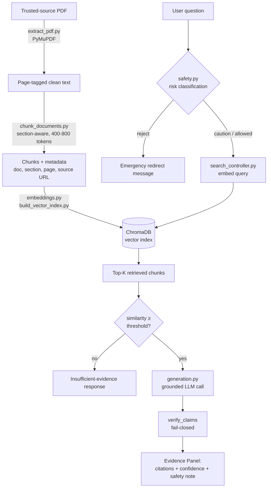

# Clinical Guideline RAG 

> A safe, source-traceable Retrieval-Augmented Generation (RAG) system that answers clinical questions **exclusively** from official medical guidelines — with every answer grounded in a citable page, and every risky question caught before it reaches the model.

Built for the **AI Hackathons** program (16–20 August 2026), organized by CREATIVA Innovation Hubs, ITIDA, TIEC, Orange Digital Center, and INSTANT Software Solutions.

---

## Table of Contents

1. [Project Overview](#1-project-overview)
2. [Problem Statement](#2-problem-statement)
3. [Proposed Solution](#3-proposed-solution)
4. [How the System Works](#4-how-the-system-works)
5. [Project Architecture](#5-project-architecture)
6. [Project Structure](#6-project-structure)
7. [Complete Pipeline](#7-complete-pipeline)
8. [Main Features](#8-main-features)
9. [Security / Safety](#9-security--safety)
10. [Evaluation](#10-evaluation)
11. [Transparency and Trust](#11-transparency-and-trust)
12. [Technologies Used](#12-technologies-used)
13. [Installation & Setup](#13-installation--setup)
14. [Usage](#14-usage)
15. [Demo / Live Video](#15-demo--live-video)

---

## 1. Project Overview

This project is a **clinical guideline RAG system** scoped to a single, well-defined topic: **hypertension (high blood pressure) management in adults**. It answers questions using only two official, publicly available sources:

- **NICE NG136** — *Hypertension in adults: diagnosis and management*
- **USPSTF** — *Screening for Hypertension in Adults* (2021 Reaffirmation Recommendation Statement)

The core value the project provides is **trustworthiness under a narrow, safety-critical domain**: instead of a general-purpose chatbot that can answer confidently from its own training data (and be wrong in ways that are hard to detect), this system is architecturally forced to answer only from retrieved passages of the source guidelines, cite exactly where each claim comes from, flag when it isn't confident, and refuse to engage with questions that look like a medical emergency.

The goal is not to replace clinical judgment — it's a **decision-support reference tool** that makes it fast to find and verify what an official guideline actually says, with the source always one click away.

## 2. Problem Statement

General-purpose language models can answer medical questions fluently and confidently — including when they are wrong. In a clinical context, a fluent but ungrounded answer is not a minor inconvenience; it's a safety risk. The core problem this project addresses:

- **No traceability**: a plain LLM answer gives no way to verify which guideline, section, or page a recommendation actually came from.
- **Confident hallucination**: models can state incorrect thresholds, dosages, or recommendations with the same tone of certainty as correct ones.
- **No sense of scope**: a general model will happily answer questions that are outside what it actually "knows" reliably, without signaling reduced confidence.
- **No safety awareness**: a plain Q&A system has no mechanism to recognize that a question ("I have crushing chest pain and my BP reads 220/130") describes a medical emergency rather than a request for general information.

Building a system that avoids these failure modes required addressing several sub-problems simultaneously: extracting clean text from real-world PDF guidelines without losing page-level traceability, splitting that text into chunks that preserve clinical meaning, retrieving the *right* passages reliably, generating answers that cite only what was actually retrieved, verifying that generated claims are truly supported by the source text, and catching unsafe queries before they ever reach the language model.

## 3. Proposed Solution

The solution is a **retrieval-first, citation-enforced RAG pipeline** with a dedicated safety layer sitting in front of generation. The guiding principle: **"a fluent answer is not necessarily a safe answer"** — every clinical recommendation surfaced by the system must be traceable to a specific passage in an official, trusted source.

Key design decisions:

- **Trusted-source-only ingestion.** Documents are only ever pulled from an explicit domain allowlist (`nice.org.uk`, `uspreventiveservicestaskforce.org`, and similar official bodies). Nothing outside that list can enter the index.
- **Page-preserving extraction and chunking.** Every chunk of text carries its document name, section title, exact page range, and source URL as metadata, so every answer can point back to a specific, checkable location.
- **A three-layer guardrail system** sits between the user's question and the language model: input risk classification, a retrieval-confidence threshold, and post-generation claim verification.
- **Structured, citation-enforced generation.** The model is prompted to act as an evidence summarizer, not a diagnostician, and must reference retrieved passages by index (`[1]`, `[2]`, …) rather than answering from its own memory.
- **Fail-closed, not fail-open.** Wherever the system can't verify something — an unsupported claim, a missing source URL, a claim-verification call that itself failed — the system is designed to lower its confidence or refuse, rather than silently presenting unverified information as trustworthy.

## 4. How the System Works

A user's question travels through the system as follows:

1. **Safety classification** — the raw query is checked against emergency and caution patterns *before* anything else happens. Emergency-pattern matches (chest pain, a blood-pressure reading in crisis range, stroke symptoms, etc.) are redirected immediately with no retrieval or generation involved.
2. **Retrieval** — for queries that pass the safety check, the query is embedded and compared against the vector index of guideline chunks. The top-K most similar chunks are retrieved, each carrying full source metadata.
3. **Confidence gate** — if the best match's similarity score falls below a configured threshold, the system responds with an explicit "insufficient evidence" answer instead of forcing the model to generate from weak or irrelevant context.
4. **Grounded generation** — the retrieved chunks are assembled into a numbered context block and passed to the language model along with the question. The model must produce a structured answer (recommendation, supporting evidence, confidence level, safety note) and reference its evidence using the `[n]` markers tied to the supplied chunks.
5. **Claim verification** — each piece of supporting evidence the model generated is independently checked against the source passages. Claims that can't be verified are flagged as *unsupported* rather than silently included.
6. **Citation assembly & confidence adjustment** — citations are built strictly from chunks the model actually referenced (out-of-range references are discarded and logged). If any citation rests on an unverified source or any claim failed verification, the reported confidence is capped rather than left at whatever the model originally claimed.
7. **Response** — the user receives the recommendation, the evidence, an explicit confidence level, a safety note, and a full citation trail (document, section, page range, source URL) for every source used.

## 5. Project Architecture

The backend follows a layered architecture that keeps HTTP concerns, business logic, and core RAG mechanics separate:

```
API layer (FastAPI routers)
        │  validates requests/responses against Pydantic schemas
        ▼
Controllers layer
        │  orchestrates one feature end-to-end (search, generate, ingest, internal stats)
        ▼
Core layer
        │  the actual RAG mechanics: embeddings, indexing, retrieval,
        │  safety classification, grounded generation, evaluation
        ▼
Data layer
     ChromaDB (vector index) + JSON artifacts (extracted text, chunks, eval sets)
```

**Component responsibilities:**

| Layer | Responsibility |
|---|---|
| `api/` | Thin FastAPI routers — request/response schema validation, routing only |
| `controllers/` | One controller per feature area; owns orchestration, error handling, and response shaping |
| `core/` | Framework-agnostic RAG logic: ingestion, chunking, embeddings, retrieval, safety, generation, evaluation |
| `schemas/` | Pydantic models defining every API request/response contract |
| `helpers/` | Cross-cutting concerns: centralized settings (`config.py`) and logging (`logger.py`) |
| `data/` | Source PDFs, extracted text, chunked JSON, evaluation question sets, and pipeline state |

A shared `BaseController` gives every controller access to settings, a logger, and a cached ChromaDB client/collection, so connection setup and configuration access are consistent across the whole backend.

## 6. Project Structure

```
Backend/
├── api/                        # FastAPI routers (one file per feature)
│   ├── health.py               #   GET /health
│   ├── api_internal.py         #   GET /internal/stats, /documents, /config, /benchmark
│   ├── search.py                #   POST /search
│   ├── generate.py              #   POST /generate
│   └── api_documents.py         #   POST /documents/upload
│
├── controllers/                # Business logic per feature, all extending BaseController
│   ├── Base_controller.py       #   Shared Chroma client/collection access, settings, logger
│   ├── internal_controller.py   #   Health, stats, config snapshot, benchmark orchestration
│   ├── search_controller.py     #   Embeds a query, runs retrieval, normalizes results
│   ├── generation_controller.py #   Ties safety → retrieval → generation together
│   └── documents_controller.py  #   Trust-gated document upload & ingestion
│
├── core/                        # The RAG engine itself
│   ├── embeddings.py             #   Singleton embedding-model loader
│   ├── build_vector_index.py     #   Embeds chunks and (re)builds the Chroma collection
│   ├── search_index.py           #   Standalone CLI search tool
│   ├── generation.py             #   Grounded answer generation + claim verification
│   ├── safety.py                 #   Input risk classification (reject / caution / allowed)
│   ├── pipeline.py               #   End-to-end ingestion orchestrator with incremental caching
│   ├── chroma_health.py          #   Startup readiness check for the Chroma service
│   ├── evaluate_retrieval.py     #   Precision@K measurement against labeled questions
│   └── evaluate_generation.py    #   Retrieval + citation accuracy + faithfulness benchmark
│
├── data/
│   ├── raw_pdfs/                 #   Source guideline PDFs
│   ├── extracted/                #   Page-level extracted text (JSON, one file per document)
│   ├── chunks/                   #   Chunked text ready for embedding (all_chunks.json + per-doc)
│   ├── scripts/
│   │   ├── extract_pdf.py         #   PDF → clean, page-tagged text
│   │   └── chunk_documents.py     #   Page text → section-aware, token-bounded chunks
│   ├── sources.json               #   Registry of trusted document sources
│   ├── eval_questions.json        #   Labeled questions for retrieval/generation evaluation
│   ├── eval_questions_safety.json #   Out-of-scope questions for guardrail testing
│   └── pipeline_state.json        #   Incremental-ingestion cache (per-document mtime/status)
│
├── schemas/                     # Pydantic request/response contracts
│   ├── internal.py                #   Health, stats, config snapshot
│   ├── schemas_search.py          #   Search request/response
│   ├── generation.py              #   Generate request/response, citation shape
│   ├── schemas_documents.py       #   Document upload request/response
│   └── benchmark.py               #   Internal benchmark response shape
│
├── helpers/
│   ├── config.py                  #   Centralized, typed settings (pydantic-settings)
│   └── logger.py                  #   Shared, consistently-formatted logger factory
│
├── utils/
│   └── response_enum.py           #   Standardized user-facing status/error messages
│
├── docker/
│   └── Dockerfile.chroma          #   Containerized ChromaDB server
│
├── main.py                       # FastAPI app entrypoint, startup pipeline, CORS
└── .env                          # Runtime configuration (not committed)
```

## 7. Complete Pipeline

The system is built around the **Ingestion → Chunking → Embeddings → Retrieval → Guardrails → Grounded LLM → Evidence Panel** pipeline:



**Stage by stage:**

| Stage | What happens | Key files |
|---|---|---|
| **1. Ingestion** | PDF is downloaded only from an allowlisted domain, text extracted page-by-page, repeated headers/footers and pagination artifacts stripped | `extract_pdf.py` |
| **2. Chunking** | Page text is split into 400–800 token, section-aware chunks; recommendation IDs and section titles are preserved as metadata | `chunk_documents.py` |
| **3. Embeddings** | Chunks are embedded with a shared, cached embedding model | `embeddings.py` |
| **4. Retrieval** | Chunk vectors are indexed in ChromaDB (cosine similarity); queries are embedded and matched against the index | `build_vector_index.py`, `search_controller.py` |
| **5. Guardrails** | Query risk classification, retrieval-confidence thresholding, and post-generation claim verification | `safety.py`, `generation_controller.py`, `generation.py` |
| **6. Grounded LLM** | The model answers strictly from the supplied, numbered context and must cite it | `generation.py` |
| **7. Evidence Panel** | The final response surfaces every citation's document, section, page range, and source URL alongside an explicit confidence level | `generation_controller.py`, `schemas/generation.py` |

## 8. Main Features

- **Source-restricted answering** — the system can only draw on content that was ingested from an explicitly trusted domain; nothing outside NICE/USPSTF (or any future trusted source) can influence an answer.
- **Full citation trail** — every answer lists exactly which document, section, page range, and source URL each piece of evidence came from.
- **Explicit confidence levels** — every response is labeled *high / medium / low / insufficient evidence*, and that label is automatically downgraded if a citation's provenance couldn't be verified or a claim failed verification.
- **Three-layer safety guardrails** — described in detail in [Section 9](#9-security--safety).
- **Claim verification (fail-closed)** — the model's own supporting evidence is independently re-checked against the source passages; if the verification step itself fails, claims are treated as *unsupported* rather than assumed safe.
- **Trust-gated document ingestion** — new guideline documents can be added via URL, but only if the URL's domain passes the trusted-source check; downloads are also capped by file size and validated as genuine PDFs.
- **Incremental ingestion pipeline** — reprocessing only happens for documents that actually changed (tracked via file modification time), so re-running ingestion after adding one new document doesn't re-embed the whole corpus.
- **Internal observability endpoints** — `/health`, `/internal/stats`, `/internal/documents`, `/internal/config`, and `/internal/benchmark` expose the system's operational state and evaluation metrics for debugging and demoing.
- **Structured evaluation tooling** — a labeled question set drives both retrieval-quality (Precision@K) and end-to-end generation-quality (citation accuracy, faithfulness) measurement.

## 9. Security / Safety

Safety is enforced in **three layers**, each catching a different failure mode:

1. **Input risk classification (`core/safety.py`)** — every incoming query is classified as `allowed`, `caution`, or `reject` *before* any retrieval or generation happens:
   - **Reject**: emergency symptom language (chest pain, loss of consciousness, stroke symptoms, etc.) *or* a numerically dangerous blood-pressure reading reported in first person (systolic ≥ 180 or diastolic ≥ 120, matching NICE NG136's own definition of severe hypertension). Rejected queries never reach the language model — the user receives an immediate redirect to seek urgent care.
   - **Caution**: personal medical context (pregnancy, a specific dose question, a child, a personally-reported reading) — the query is still answered, but the response is prefixed with an explicit disclaimer that it's general guidance, not personalized medical advice.
   - **Allowed**: general clinical questions proceed through the normal pipeline.

2. **Retrieval-confidence threshold** — if the best-matching retrieved chunk's similarity score falls below a configured threshold, generation is skipped entirely and the system returns an explicit "insufficient evidence" response instead of forcing an answer from weak context.

3. **Post-generation claim verification** — every piece of supporting evidence the model produces is independently checked against the retrieved source text. If the verification call itself fails (rather than returning a real verdict), the system **fails closed**: claims are flagged as unsupported rather than silently assumed to be fine. This means a broken verification step degrades the system's confidence rather than masking the failure.

**Additional safeguards:**
- Document ingestion is gated by an explicit trusted-domain allowlist — untrusted URLs are rejected before any download happens.
- Uploaded files are validated as genuine PDFs (by content-type and extension) and capped at a configured maximum size, enforced both on the declared size and on the actual bytes received during download.
- Chunk metadata with unverifiable provenance (missing page number or source URL) is never presented as if it were fully verified — it's explicitly marked and factored into the response's confidence level.

## 10. Evaluation

The project includes two complementary evaluation tools, both driven by a hand-labeled question set (`data/eval_questions.json`) mapping real clinical questions to the exact chunk(s) that should answer them:

- **Retrieval evaluation (`core/evaluate_retrieval.py`)** — measures **Precision@3** and **Precision@5**: for each labeled question, how many of the top-K retrieved chunks are actually among the known-correct chunks for that question. This isolates retrieval quality from generation quality.

- **Generation evaluation (`core/evaluate_generation.py`)** — runs the full pipeline (retrieval *and* generation) end-to-end and reports:
  - **Retrieval Precision@5** (as above, in the full-pipeline context)
  - **Citation accuracy** — of the citations the model actually produced, what fraction point to a genuinely correct chunk
  - **Faithfulness** — of all claims the model generated, what fraction were *not* flagged as unsupported by claim verification

  This benchmark is designed to fail loudly rather than silently: if generation breaks entirely for every question (zero claims produced), faithfulness is reported as undefined rather than a misleadingly perfect score, and every individual generation failure is logged and surfaced rather than crashing the whole run.

- **Out-of-scope / safety test set (`data/eval_questions_safety.json`)** — questions that are deliberately outside what the indexed guidelines cover (e.g., a specific drug dosage NICE NG136 doesn't specify), used to confirm the system responds with "insufficient evidence" rather than fabricating an answer.

Both evaluation tools are also exposed via `GET /internal/benchmark` for on-demand inspection.

## 11. Transparency and Trust

Every answer the system produces is designed to be independently checkable, not just plausible:

- **Nothing is cited without a traceable source.** Each citation carries the exact document name, section title, page range, and source URL it came from — a user (or a judge) can go directly to the original guideline and verify the claim themselves.
- **Confidence is explicit, not implied.** Every response states its confidence level in plain terms (high / medium / low / insufficient evidence), and that level is automatically capped if any part of the answer's grounding couldn't be fully verified.
- **The system says "I don't know" instead of guessing.** When retrieval doesn't find sufficiently relevant content, or when the model's claims can't be verified against the source text, the system reports that explicitly rather than presenting an unsupported answer with confidence.
- **Unsupported claims are surfaced, not hidden.** Any piece of generated evidence that failed independent verification against the source passages is returned to the caller as an explicit `unsupported_claims` list — visible, not silently dropped.

## 12. Technologies Used

| Technology | Role in the project |
|---|---|
| **FastAPI** | Backend web framework — API routing, request/response validation |
| **Pydantic / pydantic-settings** | Typed request/response schemas and centralized, validated configuration |
| **ChromaDB** | Vector database for storing and querying chunk embeddings (cosine similarity) |
| **PyMuPDF (fitz)** | PDF text extraction with page-level structure preserved |
| **Sentence-Transformers** | Embedding model loading and inference |
| **tiktoken** | Accurate token counting for chunk-size control during chunking |
| **Google Gemini (google-genai)** | The grounded language model used for answer generation and claim verification, called with structured output schemas |
| **httpx** | HTTP client used for trust-gated, size-limited document downloads |
| **Docker** | Containerized ChromaDB service |
| **Next.js (TypeScript)** | Frontend client application |

## 13. Installation & Setup

> Adjust package manager commands / exact file names below if your repository's `requirements.txt` or `docker-compose.yml` differ from what's described here.

### Prerequisites
- Python 3.11+
- Docker (for running ChromaDB)
- A Google Gemini API key

### 1. Clone and install dependencies
```bash
git clone <repository-url>
cd Backend
pip install -r requirements.txt
```

### 2. Configure environment variables
Create a `.env` file in `Backend/` with at least the following:

| Variable | Purpose |
|---|---|
| `CHROMA_HOST` / `CHROMA_PORT` | Chroma connection; leave `CHROMA_HOST` empty for local persistent mode |
| `COLLECTION_NAME` | Name of the Chroma collection to use |
| `EMBEDDING_MODEL` | Embedding model identifier (must be multilingual if queries are expected in more than one language) |
| `GEMINI_API_KEY` | Google Gemini API key |
| `GENERATION_MODEL` | Gemini model name used for generation |
| `SYSTEM_PROMPT` / `VERIFY_SYSTEM_PROMPT` | System instructions for answer generation and claim verification |
| `TRUSTED_DOMAINS` | JSON list of domains allowed as document sources |
| `CONFIDENCE_LABELS_AR` | JSON mapping of confidence keys to displayed labels |
| `SIMILARITY_THRESHOLD` | Minimum top-result similarity required before generation proceeds |
| `MAX_PDF_SIZE_MB` | Maximum accepted size for an uploaded document |
| `BATCH_SIZE` / `ADD_STEP` | Embedding and Chroma-write batch sizes |
| `LOG_LEVEL` | Logging verbosity |

### 3. Start ChromaDB
```bash
docker build -t hypertension-chroma -f docker/Dockerfile.chroma .
docker run -p 8000:8000 -v chroma_data:/data hypertension-chroma
```

### 4. Ingest the source guidelines
Place source PDFs in `data/raw_pdfs/` and register them in `data/sources.json`, then run:
```bash
python core/pipeline.py
```
This extracts text, chunks it, embeds it, and builds the Chroma index — and will skip any document that hasn't changed since the last run.

### 5. Run the API
```bash
uvicorn main:app --reload
```
The startup sequence waits for Chroma to be reachable and re-runs the ingestion pipeline automatically before the API becomes available.

## 14. Usage

Once the API is running (default `http://localhost:8000`):

| Endpoint | Method | Purpose |
|---|---|---|
| `/health` | GET | Service and Chroma connectivity status |
| `/search` | POST | Raw retrieval — returns the top-K matching chunks for a query |
| `/generate` | POST | Full pipeline — safety check, retrieval, grounded generation, citations |
| `/documents/upload` | POST | Ingest a new guideline document from a trusted-domain URL |
| `/internal/stats` | GET | Indexed chunk/document counts |
| `/internal/documents` | GET | Per-document chunk counts |
| `/internal/config` | GET | Non-secret configuration snapshot |
| `/internal/benchmark` | GET | Runs the retrieval + generation evaluation suite |

**Example — asking a clinical question:**
```bash
curl -X POST http://localhost:8000/generate \
  -H "Content-Type: application/json" \
  -d '{"query": "When should antihypertensive drug treatment start for stage 1 hypertension?", "top_k": 5}'
```
---

<p align="center">Built for the AI Hackathons program — a source-traceable RAG system for a domain where trust isn't optional.</p>
